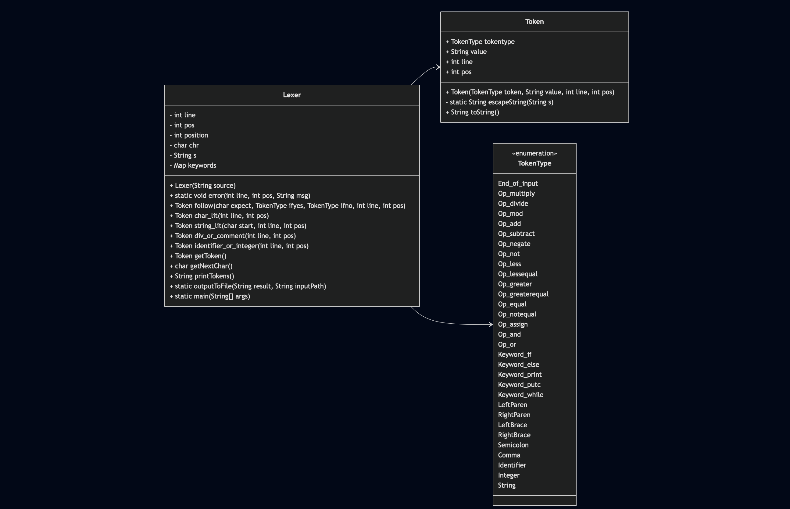

# Mini-Compiler Lexical Analyzer

This project implements a **lexical analyzer** (also called a **lexer**) for a simple C‑style language. The lexer reads one or more source files and produces a corresponding **`.lex`** file for each, listing all recognized tokens (identifiers, keywords, operators, literals, etc.) along with their position (line and column) in the original source.

## Features

- **Token Types**: Operators (`+`, `-`, `*`, `/`, `%`, `==`, `!=`, `<=`, `>=`, `&&`, `||`, etc.), symbols (`(`, `)`, `{`, `}`, `;`, `,`), keywords (`if`, `else`, `while`, `print`, `putc`), identifiers, integer literals, character literals (with escape sequences), string literals (with `\n`, `\\`, `\"`), and `End_of_input`.
- **Comment Handling**: Skips both **`//`** single-line and **`/* ... */`** block comments.
- **Multi-file Support**: Accepts any number of filenames on the command line and generates matching `.lex` files automatically, instead of hard‑coding input/output names.

## Project Structure



## Requirements

- **JetBrains IntelliJ IDEA** IDE recommended for running program and tests.
- **Java 22** recommended
- **JUnit 5** for running unit tests

## Running and Usage Example

In the IntelliJ IDE, open up the terminal and make sure you are in the project directory.  
Example listed below for using the Lexer to inspect the files "count.c" and "loop.py".
```bash
$ java src/main/java/Lexer.java src/main/resources/count/count.c src/main/resources/loop/loop.py
# Generates: count.lex and loop.lex
```

Inspecting **`count.lex`**:
```
    1      1 Identifier     count
    1      7 Op_assign     
    1      9 Integer         1
    1     10 Semicolon      
    …
    6      1 End_of_input  
```

## Notes

- Files in the subdirectories of the "resources" directory are included for testing purposes, with sample .lex files already generated for reference.